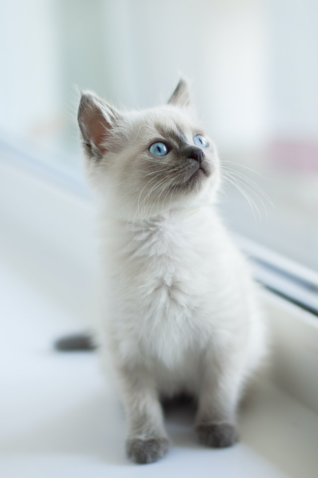

```{r, include = FALSE}
knitr::opts_chunk$set(
  collapse = TRUE,
  comment = "#>"
)
```

## `knitr::include_graphics()`

``` {r}
knitr::include_graphics("../man/figures/kitten.jpg")
```

``` {r}

```

## rmarkdown


## External package

```{r magick}
magick::image_read("another-kitten.jpg")
```

## Plot

```{r plot}
plot(1:3)
```